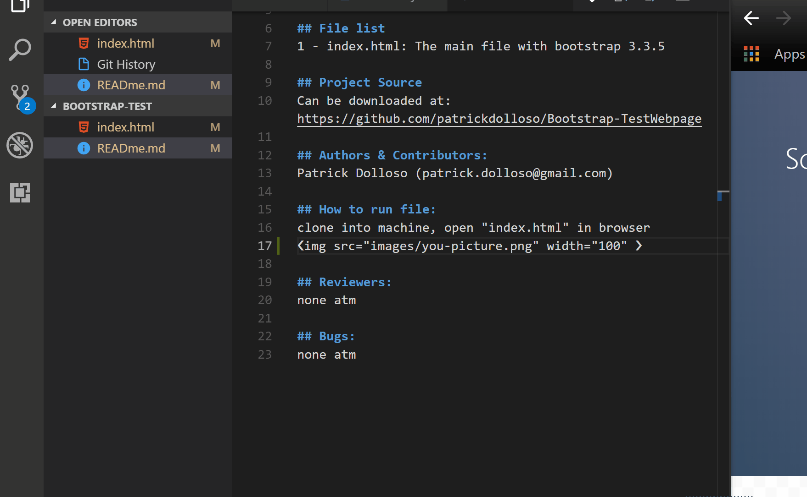

# Bootstrap Tutorial & Sample Tests

link: 
https://github.com/patrickdolloso/Bootstrap-TestWebpage

## About
This is a quick bootstrap test to sharpen my Front End Designing skills required for the Front End Libraries Certification in FreeCodeCamp & my BS-CS degree at UOP

## File list
1 - index.html: The main file with bootstrap 3.3.5

## Project Source
Can be downloaded at: https://github.com/patrickdolloso/Bootstrap-TestWebpage/archive/master.zip

## Authors & Contributors:
Patrick Dolloso (patrick.dolloso@gmail.com)

## How to run file:
clone into machine, open "index.html" in browser
 

## Reviewers:
none atm

## Bugs:
none atm

> Markdown tut:
> https://daringfireball.net/projects/markdown/syntax

